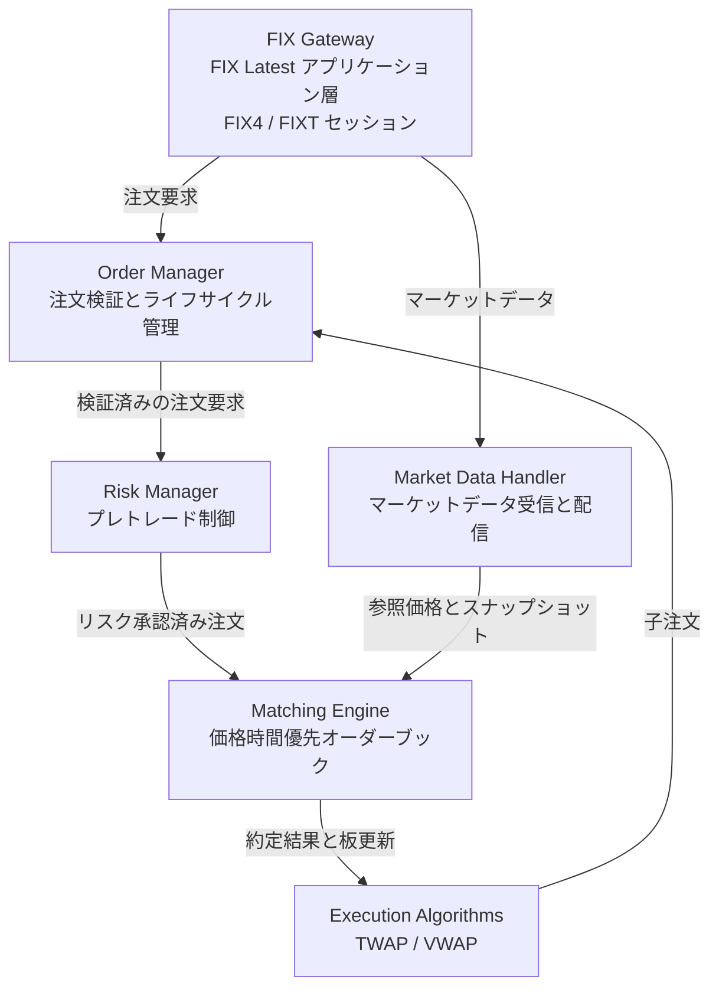
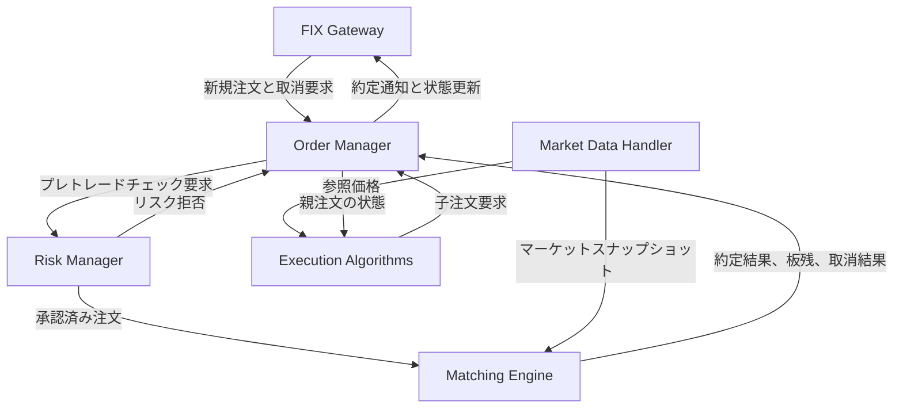
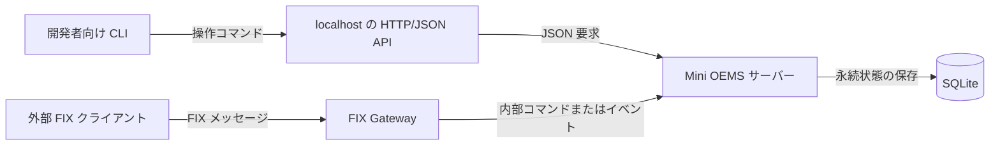
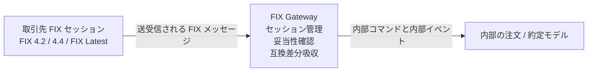
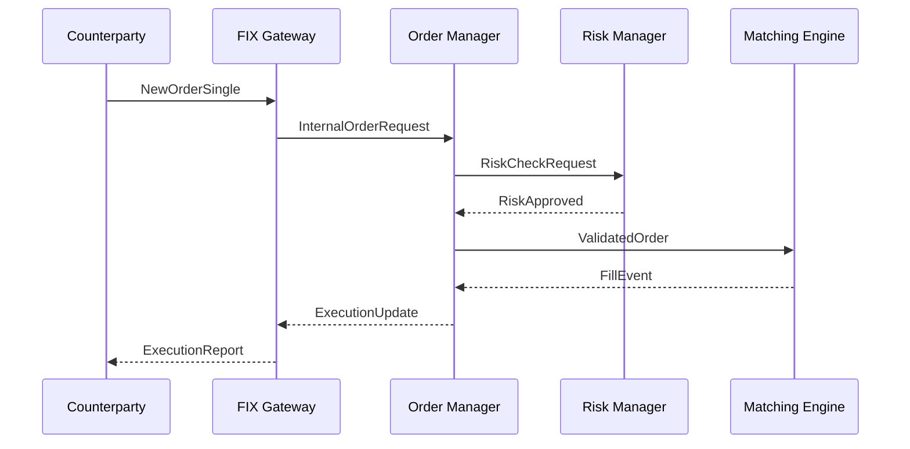
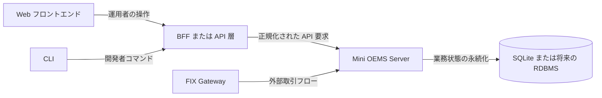

# Mini OEMS アーキテクチャ

最終確認日: 2026-04-04

## 概要

Mini OEMSは、注文管理（OMS）と執行管理（EMS）を統合したミニマルなシステムである。外部との接続にはFIXを使い、リスクチェックを通した注文を価格時間優先でマッチングし、TWAPやVWAPのような執行アルゴリズムも扱う。

このドキュメントでは、FIXの前提を次のように置く。

- アプリケーション層は **FIX Latest** を基準に考える
- セッション層は **FIX4** または **FIXT** プロファイルを想定する
- 実務上は **FIX 4.2 / FIX 4.4** 互換の取引先接続が残る前提を許容する
- セキュアな接続は **FIXS/TLS** を前提にする

FIXそのものの背景は [fix-latest-guide.ja.md](./fix-latest-guide.ja.md) を参照。
この文書を Mini OEMS の v1 システム設計の正本として扱う。

## 設計ゴール

- マッチングの中核経路を単純で決定的に保つ
- 取引先ごとの差分をFIX Gateway境界に閉じ込める
- 注文状態遷移を監査しやすく、追跡可能にする
- 過剰な機能追加より、運用時の振る舞いの明確さを優先する
- 最初の使える形を、開発者向けのローカルデモとして成立させる

## 現実的な想定

ここでは、実際のシステムデザイン面接で聞かれやすい、現実寄りの前提を明示する。これは厳密な制約ではなく、設計の重心を示すための想定である。

- 接続先は少数から中程度の機関投資家・ブローカーで、同時にアクティブなFIXセッションは10〜50程度
- 注文メッセージ流量はピークでも毎秒数千件規模で、超高頻度取引所レベルの毎秒数百万件は前提にしない
- マーケットデータは注文よりずっとバーストしやすいため、注文処理経路と分離して考える
- マッチングエンジンには低レイテンシが求められるが、最初から取引所級のマイクロ秒最適化を主目的にはしない
- プロセス再起動、FIX切断、重複送信、再送要求に対して、運用者が説明できる回復手順が必要
- 監査性は必須であり、外部注文と内部状態遷移を追跡できる必要がある

## 最初の利用者

このシステムの最初の利用者は開発者である。

- 開発者がローカルでサーバーを起動する
- 開発者が CLI から注文と取消を送る
- 開発者が板、注文状態、約定を確認する
- 将来的に Web UI や外部 FIX 接続を足しても、コア設計を大きく崩さない

## コンポーネント

この図では、矢印ラベルが「その境界を何が通るか」を表している。

## モジュール同士の作用

上の図は「何があるか」を示している。次の図は、通常時にどのモジュールがどのモジュールを動かすかを示している。

この図の読み方は次の通りである。

- `Order Manager` は注文ライフサイクル全体の司令塔である
- `Risk Manager` は注文状態を持たず、先へ進めてよいかを判定する
- `Matching Engine` は板を書き換え、結果を `Order Manager` に返す
- `Execution Algorithms` は制御を迂回せず、子注文を必ず `Order Manager` に戻す
- `Market Data Handler` は注文状態を直接変えず、マッチングと執行アルゴリズムに市場文脈を渡す
- `FIX Gateway` は外側のプロトコル境界であり、外向き通知は `Order Manager` から受け取る

## v1 の配置イメージ

v1 では、人間の利用者は FIX を直接使わない。人間は CLI からローカル API を叩き、FIX は外部システム接続の境界として持つ。

## v1 の機能範囲

v1 に含めるもの:

- 現物株のみ
- 単一銘柄または少数銘柄
- 指値注文と成行注文
- 新規注文
- 取消
- 板表示
- 注文一覧表示
- 約定履歴表示
- SQLite を使った再起動回復
- 最小 FIX Acceptor

v1 に含めないもの:

- Web フロントエンド
- ブラウザ向け BFF
- 本番用認証認可
- 分散マッチング
- マルチアセット対応
- 高度なブローカールーティング
- TWAP/VWAP を超える高度な執行ロジック

## v1 の操作インターフェース

最初の利用者は開発者であり、v1 の操作面は CLI とローカル HTTP/JSON 境界で構成する。

CLI コマンド:

- `oems-cli server-status`
- `oems-cli new-order --symbol SYMBOL --side buy|sell --qty QTY --type limit|market [--price PRICE]`
- `oems-cli cancel-order --order-id ORDER_ID`
- `oems-cli show-orders [--symbol SYMBOL] [--status STATUS]`
- `oems-cli show-book --symbol SYMBOL`
- `oems-cli show-trades [--symbol SYMBOL] [--limit N]`

ローカル HTTP/JSON API:

- `GET /v1/health`
- `POST /v1/orders`
- `POST /v1/orders/{order_id}/cancel`
- `GET /v1/orders`
- `GET /v1/orders/{order_id}`
- `GET /v1/books/{symbol}`
- `GET /v1/executions`

この境界を置く理由は次の通りである。

- CLI を状態を持たない薄いクライアントに保てる
- 常駐サーバーを唯一の正本にできる
- 将来 Web UI を足すときにも同じ境界を使える

## FIX 連携の境界

FIX Gatewayは、単なる文字列パーサではない。外部FIXセッションと内部ドメインモデルの境界であり、次を担当する。

- セッション確立と回復
- 受信メッセージの妥当性確認
- 取引先ごとの差分吸収
- FIXメッセージと内部コマンド／イベントの相互変換

### FIX Gateway

- 注文、約定、マーケットデータ関連のFIXメッセージを受信・送信する
- FIX4 / FIXT セッションでの Logon、Logout、Heartbeat、シーケンス管理、再送、回復を扱う
- FIX 4.2、FIX 4.4、FIX Latest の使い方の違いを取引先単位で吸収する
- 外部FIXメッセージを内部リクエストへ変換し、内部イベントを外部FIXメッセージへ変換する

具体例:

- 外部から `NewOrderSingle` を受けたら、内部の注文作成リクエストへ変換する
- 内部で約定が確定したら、外部向けには `ExecutionReport` として通知する

### Order Manager

- 受け付けから約定完了・取消までの注文ライフサイクルを管理する
- 内部注文IDを払い出し、外部IDとの対応を追跡する
- リスクとマッチングへ渡す前に業務妥当性を確認する

### Risk Manager

- 数量上限、想定元本、価格レンジなどのプレトレード制御を行う
- アカウント単位のポジション制限や注文レート制限を適用する
- 危険な注文をマッチングエンジン到達前に拒否する

### Matching Engine

- 価格時間優先のオーダーブックを維持する
- 指値、成行などの基本注文タイプを扱う
- 決定的な約定結果とオーダーブック更新を生成する

### Execution Algorithms

- 親注文を子注文へ分割する
- TWAP や VWAP のような基本執行ロジックを提供する
- 子注文も通常の注文経路へ戻すことで、リスクと監査の一貫性を保つ

### Market Data Handler

- BBO などのマーケットデータを受信する
- 下流向けスナップショットを構築する
- マーケットデータのバーストが注文経路を不安定にしないよう、注文処理と分離する

## データフロー

1. 取引先からFIX Gatewayへメッセージが届く
2. FIX Gatewayがセッション状態とメッセージ形式を検証し、内部リクエストへ変換する
3. Risk Managerがプレトレード制御を適用する
4. Matching Engineがオーダーブックへ投入または即時マッチングする
5. 生成された約定や状態変化を、FIX Gatewayが `ExecutionReport` などの外部メッセージへ変換する
6. 執行アルゴリズムの子注文も同じ経路を通る

## 注文フロー例

この分離が重要なのは、面接でも実運用でも同じである。

- プロトコルの都合はGatewayに閉じ込める
- 業務ライフサイクルはOrder Managerに集約する
- 市場ルールはRiskに持たせる
- 価格時間優先の責務はMatchingに限定する

## 状態管理と保存

現実的な設計では、セッションの一時状態と業務上の永続状態を分けて考える必要がある。

- FIXセッション状態は、シーケンス番号、相手先識別子、回復に必要な情報を再接続後も使えるよう保持する
- 注文状態は、受理、取消、約定、拒否を耐久ストレージに保存する
- 約定イベントは追跡やリプレイのため、追記中心で扱う
- マーケットデータのスナップショットはメモリ中心でもよいが、必要なら集計結果を保存する

実用的な初期構成としては、次が妥当である。

- 注文、約定、口座、監査ログ用の耐久リレーショナルストレージ
- 調査とリプレイ用の追記型イベントログ
- ライブマッチング用のインメモリオーダーブック

v1 では、SQLite に少なくとも次を持たせる。

- `orders` は注文の最新状態を持つ
- `executions` は発生した約定を持つ
- `order_events` は状態変化を追記型で持つ
- `audit_log` は操作、プロトコル、業務イベントを持つ
- `service_state` は起動回復用のメタデータを持つ

再起動時は次の順で回復する。

1. SQLite を開く
2. 耐久化された注文状態を読む
3. `order_events` を再生する
4. 未完了注文からインメモリの板を再構築する
5. 直近の約定を読み込み、表示可能にする

この回復モデルにより、ライブのマッチングはメモリ上で保ちつつ、再起動後に状態を説明できる。

## v1 の FIX 範囲

v1 の FIX 境界は意図的に狭く保つ。

受信側:

- `Logon`
- `Logout`
- `Heartbeat`
- `TestRequest`
- `NewOrderSingle`
- `OrderCancelRequest`

送信側:

- `Logon`
- `Logout`
- `Heartbeat`
- `ExecutionReport`
- 必要最小限のセッション拒否または業務拒否メッセージ

これにより、面接で説明できる現実性を保ちつつ、最初からフル機能のブローカー実装を目指しすぎないようにする。

## スケーラビリティと耐障害性

面接向けに現実的なスケール戦略を言うなら、次の姿勢になる。

- FIXセッションはGateway層で水平分散する
- Matching Engineは、銘柄または銘柄グループごとに、同時に1つの更新主体だけが板を書き換える方式を保つ
- マーケットデータ取り込みは注文経路から分離する
- 順序保証を壊さない範囲でのみ、キューや耐久ログを境界に入れる

障害時の考え方:

- FIXセッションが切れたらGatewayが再接続し、シーケンスを回復する
- Gatewayが再起動しても、永続化されたセッション情報で盲目的な再送を避ける
- Riskが使えないなら、新規注文を止める保守的な挙動を取る
- Matchingが使えないなら、執行可能な新規注文を受け付け済みとして先へ進めない

## 監視と運用

現実的な設計回答には、運用可視性も必要である。

- セッション指標: logon数、切断数、再送要求、シーケンスギャップ
- 注文指標: accept、reject、cancel、fill、レイテンシパーセンタイル
- マーケットデータ指標: 受信レート、遅延、ドロップ数
- 外部注文ID、内部注文ID、約定IDで引ける構造化監査ログ

運用者が最低限答えられるべき問い:

- そのメッセージを受け取ったか
- バリデーションは通ったか
- リスクで落ちたか
- マッチングで約定したか
- 取引先へ何を返したか

## トレードオフ

- FIX Latest を基準にしつつ FIX 4.2 / 4.4 を吸収すると Gateway は複雑になるが、内部ドメインはきれいに保ちやすい
- 銘柄ごとに1つの更新主体だけが板を書き換える構成にすると水平スケールは制約されるが、順序保証と正しさは保ちやすい
- 強い監査性はストレージやイベント量を増やすが、金融システムではほぼ必須である
- CLI 中心の v1 は見た目の派手さでは Web UI に劣るが、取引ロジックと境界設計に集中できる

## 将来の拡張像

長期的には次の方向へ伸ばせるようにしておく。

- v1 はローカルサーバー + CLI
- その後、運用者向けの Web UI を追加する
- CLI と Web の両方から使える API 境界を保つ
- FIX は外部システム接続として段階的に広げる

## 実装順序

1. **Matching Engine** — オーダーブックと約定ロジックの中核
2. **Order Manager** — ライフサイクルと内部状態遷移
3. **Risk Manager** — プレトレード制御
4. **FIX Gateway** — 外部接続境界と互換吸収
5. **Execution Algorithms** — TWAP/VWAP の親子注文制御
6. **Market Data Handler** — マーケットデータ受信とスナップショット
