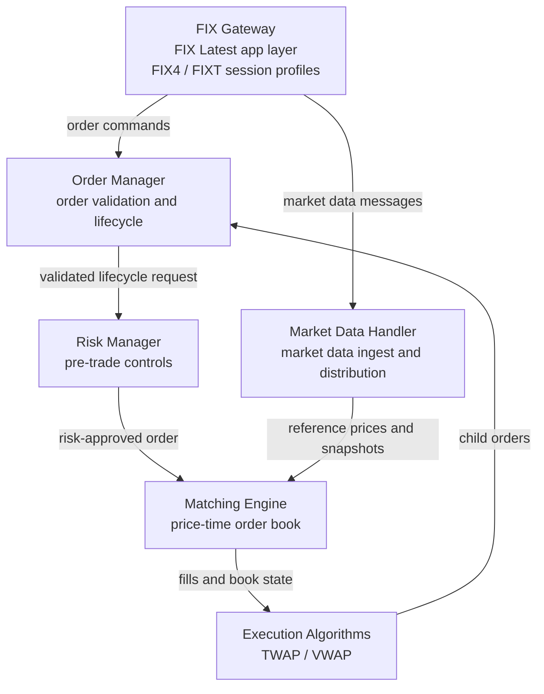
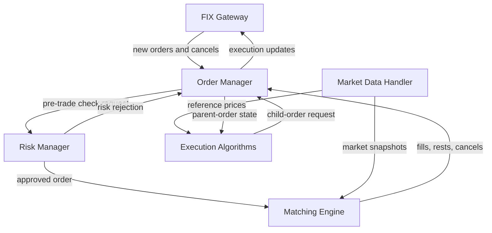
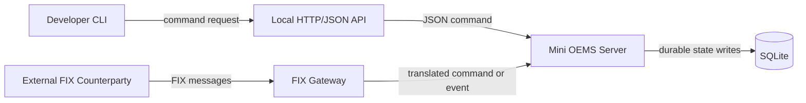
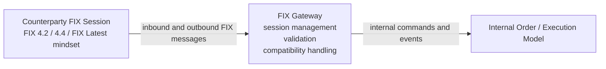
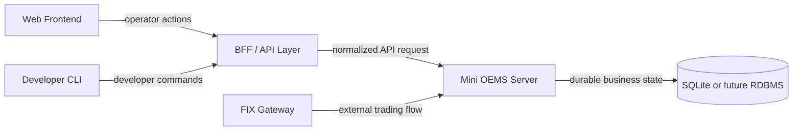
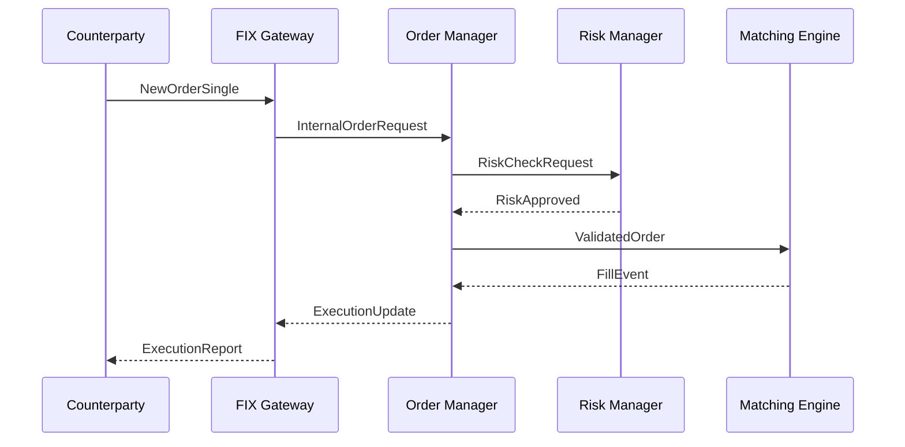

# Mini OEMS Architecture

Last reviewed: 2026-04-04

## Overview

Mini OEMS is a minimal Order Management System (OMS) and Execution Management System (EMS). It accepts external order flow over FIX, applies risk checks, matches orders with price-time priority, and supports execution algorithms such as TWAP and VWAP.

This document uses the following FIX stance:

- Treat **FIX Latest** as the application-layer baseline.
- Assume **FIX4** or **FIXT** session profiles for modern sessions.
- Allow practical interoperability with **FIX 4.2 / FIX 4.4** counterparties where needed.
- Assume secure transport via **FIXS/TLS**.

Background on FIX itself is covered in [fix-latest-guide.md](./fix-latest-guide.md).
This document is also the canonical v1 system design for Mini OEMS.

## Design Goals

- Keep the core matching path simple and deterministic.
- Isolate counterparty-specific FIX differences inside the gateway boundary.
- Make order state transitions auditable and replayable.
- Prefer clear operational behavior over maximum feature breadth.
- Make the first usable form a developer-friendly local demo rather than a production trading platform.

## Realistic Interview Assumptions

These assumptions are intentionally realistic in the style of a system design interview. They are not hard implementation limits, but they define the target shape of the system.

- The system serves a small number of institutional counterparties, for example 10 to 50 active FIX sessions.
- Peak inbound order flow is in the low thousands of messages per second, not millions.
- Market data is bursty and much higher volume than order flow, so market data handling must be isolated from order handling.
- The matching engine is expected to provide predictable low latency, but strict exchange-grade microsecond performance is not the first goal of this project.
- Operators need clear recovery after process restarts, broken FIX sessions, and duplicate or replayed messages.
- Auditability matters: every external order and every internal state transition should be traceable.

## Primary User

The first user of this system is the developer building and demonstrating it.

- The developer starts the service locally.
- The developer submits and cancels orders from a CLI client.
- The developer inspects books, orders, and executions locally.
- The developer can later add real FIX counterparties or a web UI without redesigning the core.

## Components

In this diagram, each edge label names the main thing that crosses the boundary.

## How Modules Interact

The component list above shows what exists. The diagram below shows who drives whom during normal operation.

Read this diagram as follows:

- `Order Manager` is the coordinator for order lifecycle changes.
- `Risk Manager` does not own order state. It decides whether flow may continue.
- `Matching Engine` owns book mutation and emits outcomes back to `Order Manager`.
- `Execution Algorithms` do not bypass controls. They submit child orders back through `Order Manager`.
- `Market Data Handler` does not mutate orders directly. It supplies market context to matching and algorithms.
- `FIX Gateway` is the protocol boundary on the outside and receives outbound execution updates from `Order Manager`.

## V1 Deployment Shape

For v1, the human operator does not talk FIX directly. The human uses CLI commands over a local API, while FIX remains the external system boundary.

## V1 Functional Scope

V1 includes:

- cash equities only
- one or a small number of symbols
- limit and market orders
- new order
- cancel order
- show book
- show active and historical orders
- show executions
- SQLite-backed restart recovery
- minimal FIX acceptor support

V1 does not include:

- web frontend
- browser-facing BFF
- production authentication and authorization
- distributed matching
- multi-asset support
- advanced broker routing
- advanced execution logic beyond simple TWAP/VWAP scaffolding

## V1 Operator Interface

The first operator is the developer. The v1 control surface is the CLI over a local HTTP/JSON boundary.

CLI commands:

- `oems-cli server-status`
- `oems-cli new-order --symbol SYMBOL --side buy|sell --qty QTY --type limit|market [--price PRICE]`
- `oems-cli cancel-order --order-id ORDER_ID`
- `oems-cli show-orders [--symbol SYMBOL] [--status STATUS]`
- `oems-cli show-book --symbol SYMBOL`
- `oems-cli show-trades [--symbol SYMBOL] [--limit N]`

Local HTTP/JSON endpoints:

- `GET /v1/health`
- `POST /v1/orders`
- `POST /v1/orders/{order_id}/cancel`
- `GET /v1/orders`
- `GET /v1/orders/{order_id}`
- `GET /v1/books/{symbol}`
- `GET /v1/executions`

This boundary exists so:

- the CLI stays stateless
- the long-running server stays the source of truth
- the same boundary can later serve a web UI

## FIX Integration Boundary

The FIX Gateway is not just a string parser. It is the boundary between external protocol traffic and the internal trading domain. It is responsible for:

- session establishment and recovery
- validation of incoming FIX messages
- compatibility handling across counterparties
- translation between FIX messages and internal commands/events

### FIX Gateway

- Receives and sends order, execution, and market-data-related FIX messages.
- Manages FIX4 / FIXT session behavior such as Logon, Logout, Heartbeat, sequence numbers, resend, and recovery.
- Absorbs counterparty-specific differences across FIX 4.2, FIX 4.4, and modern FIX Latest usage.
- Converts external FIX messages into internal domain requests and converts internal events back into outbound FIX messages.

Example:

- An inbound `NewOrderSingle` becomes an internal order request.
- A confirmed internal fill becomes an outbound `ExecutionReport`.

### Order Manager

- Owns the order lifecycle from accepted to filled or cancelled.
- Assigns and tracks internal order identifiers.
- Applies business validation before routing to risk and matching.

### Risk Manager

- Applies pre-trade controls such as max quantity, notional limits, and price bands.
- Enforces rate limits and account-level position constraints.
- Rejects unsafe orders before they reach the matching engine.

### Matching Engine

- Maintains a price-time-priority order book.
- Supports core order types such as limit and market orders.
- Produces deterministic fills and order-book state changes.

### Execution Algorithms

- Split parent orders into child orders.
- Support basic execution styles such as TWAP and VWAP.
- Feed generated child orders back through the normal order path so risk and audit logic stay consistent.

### Market Data Handler

- Receives BBO and related market-data feeds.
- Builds snapshots for downstream consumers.
- Stays isolated from the order path so market-data bursts do not destabilize order processing.

## Future Expansion Path

The intended long-term shape is:

- v1: local server plus CLI
- later: web frontend for operator visibility and demos
- later: BFF or API layer that can serve both CLI and web clients
- later: richer FIX connectivity for external venues or broker simulators

## Data Flow

1. A counterparty sends an inbound FIX message to the FIX Gateway.
2. The FIX Gateway validates session state and message shape, then maps the message into an internal request.
3. The Risk Manager applies pre-trade controls.
4. The Matching Engine inserts the order into the book or matches it immediately.
5. The resulting execution or state change is converted by the FIX Gateway into an outbound message such as `ExecutionReport`.
6. Execution algorithms submit child orders through the same path.

## Example Order Flow

This separation matters in interviews and in production:

- protocol concerns stay in the gateway
- business lifecycle stays in the order manager
- market rules stay in risk
- price-time behavior stays in matching

## State and Storage

A realistic deployment should separate transient session state from durable business state.

- FIX session state should persist sequence numbers, peer identity, and recovery metadata across reconnects.
- Order state should persist accepted orders, cancels, fills, and rejections in durable storage.
- Execution events should be append-only so operators can replay or audit them.
- Market-data snapshots may be held in memory, while derived summaries can be persisted if needed.

A practical starting point is:

- durable relational storage for orders, executions, accounts, and audit records
- append-only event log for replay and investigation
- in-memory order books for live matching

For v1, the durable SQLite state should include:

- `orders` for the latest durable order view
- `executions` for fills produced by matching
- `order_events` for append-only lifecycle changes
- `audit_log` for operator, protocol, and business activity
- `service_state` for recovery metadata such as startup markers and session metadata

On restart, the server should:

1. open SQLite
2. load durable order state
3. replay `order_events`
4. rebuild in-memory books from active open orders
5. load recent executions for operator visibility

This recovery model keeps matching live in memory while preserving enough durable history to explain state after a restart.

## Minimal FIX Scope

The v1 FIX boundary is intentionally narrow.

Inbound support:

- `Logon`
- `Logout`
- `Heartbeat`
- `TestRequest`
- `NewOrderSingle`
- `OrderCancelRequest`

Outbound support:

- `Logon`
- `Logout`
- `Heartbeat`
- `ExecutionReport`
- session-level or business-level reject messages as needed

This keeps the project realistic enough for interviews without pretending to be a full broker-grade FIX stack.

## Scalability and Resilience

For a realistic interview answer, the main scaling posture is:

- scale FIX sessions horizontally at the gateway layer
- keep the matching engine single-writer per symbol partition or instrument group
- isolate market-data ingestion from the order path
- use queues or durable logs between boundaries only where they do not break ordering guarantees

Failure handling assumptions:

- if a FIX session drops, the gateway should reconnect and recover sequence numbers
- if the gateway restarts, durable session metadata prevents blind replay
- if risk is unavailable, fail closed and reject or pause new orders
- if matching is unavailable, do not acknowledge new executable flow as accepted for market interaction

## Observability and Operations

A realistic system design answer also needs operational visibility:

- per-session metrics: logons, disconnects, resend requests, sequence gaps
- order metrics: accepts, rejects, cancels, fills, latency percentiles
- market-data metrics: ingest rate, lag, dropped updates
- structured audit trail keyed by external order ID, internal order ID, and execution ID

Operators should be able to answer:

- did we receive the message?
- did we validate it?
- did risk reject it?
- did matching execute it?
- what did we send back to the counterparty?

## Trade-Offs

- Supporting FIX Latest while interoperating with FIX 4.2 / 4.4 increases gateway complexity, but keeps the core domain model cleaner.
- A single-writer matching model limits horizontal scaling, but preserves deterministic ordering and simpler correctness.
- Strong auditability adds storage and event overhead, but is usually non-negotiable in financial systems.
- A CLI-first v1 is less impressive visually than a web UI, but it focuses effort on trading logic and system boundaries.

## Implementation Order

1. **Matching Engine** — core order book and fill logic
2. **Order Manager** — lifecycle and domain state transitions
3. **Risk Manager** — pre-trade controls
4. **FIX Gateway** — external protocol boundary and compatibility handling
5. **Execution Algorithms** — TWAP/VWAP parent-child order flow
6. **Market Data Handler** — market-data ingest and snapshots
