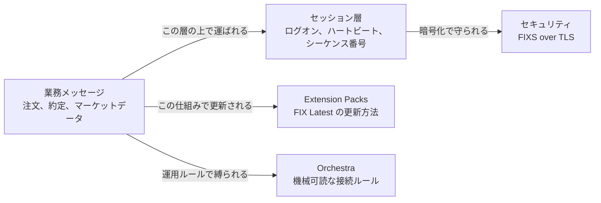
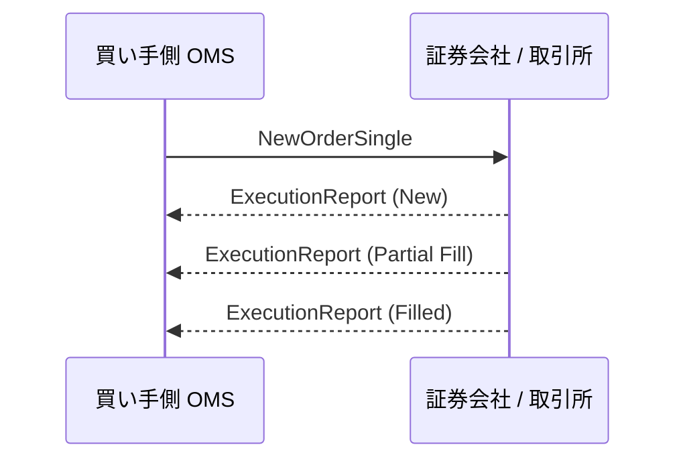
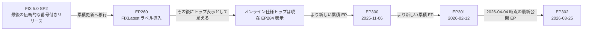
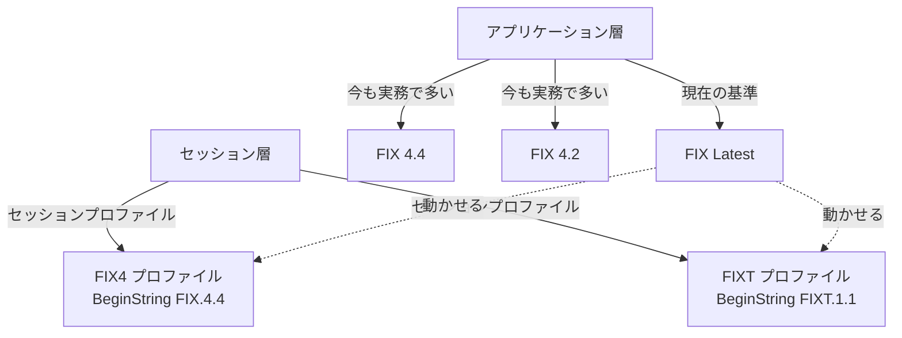

# 2026年時点のFIX入門ガイド

最終確認日: 2026-04-04

## まず押さえること

FIXは、証券会社、銀行、取引所、アセットマネージャーなどが、売買関連メッセージを電子的にやり取りするための共通言語です。

金融初心者なら、まず次の3点を押さえると全体像が崩れません。

- FIXは単なる古い `tag=value` 文字列ではなく、売買メッセージ、セッション管理、暗号化、機械可読な接続仕様まで含む標準群です。
- 現在のアプリケーション層の基準は **FIX Latest** です。昔のように大きな版番号を切り替えるのではなく、**Extension Pack (EP)** を積み上げて進化します。
- 2026-04-04 時点では、公式オンライン仕様トップは **EP284** 表示のままですが、公式の Extension Packs 一覧では **EP302** が **2026-03-25** 付で公開されています。つまり、最新状況を正しく見るには両方を確認する必要があります。

## FIXは何をするものか

平たく言うと、FIXはコンピュータ同士に次のような会話をさせるためのルールです。

- 「この注文を出したい」
- 「注文を受け付けた」
- 「注文の一部が約定した」
- 「最新の価格情報を送る」
- 「配分や確認などの約定後情報を送る」

公式のアプリケーション層仕様では、FIXは次の業務領域に分けられています。

- Introduction
- Pre-Trade
- Trade
- Post-Trade
- Infrastructure

参考:

- [FIX Latest Online Specification](https://www.fixtrading.org/online-specification)

## いちばん簡単な理解のしかた



このガイドでは、矢印ラベルは「何がどう関係するか」を表しており、単なる通信方向だけを示しているわけではない。

### 業務メッセージ

注文、約定通知、取消、マーケットデータ、配分、確認など、実際の取引業務に関わるメッセージです。

### セッション層

通信を壊れにくくする土台です。ログオン、ログアウト、ハートビート、シーケンス番号、再送要求、ギャップ回復などを扱います。

公式セッション仕様では、TCP/IP を使うなら **FIX-over-TLS (FIXS)** による暗号化を前提とする考え方が示されています。

### Extension Pack

FIXの新機能は、現在は Extension Pack で追加されます。新しいEPが出るたびに、FIX Latest はそれ以前の変更をすべて含んだ累積版になります。

### Orchestra

実務では、標準仕様だけでは足りません。相手先ごとに、どのメッセージを使うか、どの項目を必須にするか、どういう返答順にするかを決める必要があります。**FIX Orchestra** は、その運用ルールを機械可読にするための標準です。

参考:

- [FIX Session Layer Online](https://www.fixtrading.org/standards/fix-session-layer-online/)
- [FIX Extension Packs](https://www.fixtrading.org/extension-packs/)
- [Orchestra Online](https://www.fixtrading.org/standards/fix-orchestra-online/)

## かんたんな注文フロー



初心者向けに要点だけ言うと、FIXの基本は次の流れです。

- まず注文を送る
- 相手が受け付けたことを返す
- その後、約定の進み具合を返す

これが、FIXが「取引ライフサイクルを標準化する仕組み」と言われる理由です。

## 具体的なメッセージ例

以下の例は、理解しやすさのために意図的に簡略化しています。

- 実際の区切り文字ではなく、見やすいように `|` を使っています
- `BodyLength(9)` や `CheckSum(10)` のような項目は省略しています
- 完全な本番電文ではなく、「何が言いたいメッセージか」を掴むための最小例です

### Logon の例

```text
8=FIXT.1.1|35=A|49=BUY1|56=BROKER1|98=0|108=30|1137=10
```

意味:

- `35=A` は Logon
- `49` と `56` は送信者と受信者
- `108=30` はハートビート間隔30秒
- `1137=10` はデフォルトのアプリケーション版を示すために使われる

### 新規注文の例

```text
35=D|49=BUY1|56=BROKER1|11=ORD123|55=7203.T|54=1|38=100|40=2|44=2500|59=0
```

意味:

- `35=D` は `NewOrderSingle`
- `11=ORD123` は顧客側の注文ID
- `55=7203.T` は銘柄
- `54=1` は買い
- `38=100` は数量
- `40=2` は指値注文
- `44=2500` は指値価格
- `59=0` は当日注文

平たく言えば、「この銘柄を2500円で100株買いたい」という意味です。

### 約定通知の例

```text
35=8|49=BROKER1|56=BUY1|11=ORD123|37=BRK9001|17=EXEC1|150=F|39=2|14=100|151=0
```

意味:

- `35=8` は `ExecutionReport`
- `11=ORD123` は元の注文との対応付け
- `37=BRK9001` は証券会社側の注文ID
- `17=EXEC1` は約定ID
- `150=F` は約定が発生したことを示す
- `39=2` は注文が完了済み
- `14=100` は累計約定数量が100
- `151=0` は未約定残が0

平たく言えば、「あなたの注文は全量約定しました」という意味です。

## いま「最新」とは何か



ここで重要なのは次の点です。

- FIX 5.0 SP2 が、昔ながらの番号付きアプリケーション版の最後だった
- その後は Extension Pack を積み上げる方式に変わった
- FIX Latest は、その累積結果を指す

ただし、ドキュメントを見るときは少し注意が必要です。

- 公式トップページはまだ **EP284** 表示
- Extension Packs 一覧は **EP302** まで公開
- 配布物の一部は、最新EP表示より少し遅れる

2026-04-04 時点では:

- [FIX Latest Online Specification](https://www.fixtrading.org/online-specification) は EP284 表示
- [FIX Extension Packs](https://www.fixtrading.org/extension-packs/) は EP302 まで掲載
- [Latest FIXimate](https://www.fixtrading.org/packages/latest-fiximate/) は EP301 表示
- [Latest FIXML Schema](https://www.fixtrading.org/packages/latest-ep-fixml-schema/) は EP301 表示

初心者向けには、次の見方が安全です。

- 構造や概念の理解にはオンライン仕様トップを使う
- 直近の追加点を見るには Extension Packs 一覧を使う

## 対応バージョンと、初心者が混乱しやすい点



初心者がよく勘違いするのは、`BeginString(8)` を見ればFIX全体の版が分かる、と思ってしまうことです。

現在はそうではありません。

- `BeginString(8)` は主に **セッションプロファイル** を示す
- アプリケーション版は `DefaultApplVerID(1137)` などで別に伝える

そのため、実際のFIX接続は次の3つの組み合わせとして理解すると正確です。

- どのアプリケーション版の業務メッセージを使うか
- どのセッションプロファイルで運ぶか
- 相手先がどの運用ルールを要求するか

実務的な結論は次の通りです。

- 新しい機能の基準は **FIX Latest**
- 既存の取引先では **FIX 4.2** や **FIX 4.4** がまだ重要
- 現代的な実装は、その両方を理解できる必要がある

参考:

- [Supported Versions of the FIX Protocol](https://www.fixtrading.org/supported-versions-of-the-fix-protocol/)
- [FIX Session Layer Online](https://www.fixtrading.org/standards/fix-session-layer-online/)

## FIXはどこへ向かっているか

最近のEPを見ると、FIXは単なる延命ではなく、実際の市場課題に合わせて更新されています。

例:

- **EP300** は EU consolidated tape 対応
- **EP301** は証券貸借取引の拡張と、英国債券の consolidated tape 関連改善
- **EP302** は複数レッグ戦略やスワップ中の FX NDF fixing 情報を強化

さらに、2026年の動きとして:

- **24時間の米国株取引** が標準化テーマになっている
- **AIリスク管理** に関する提言が出ている
- AIツール向けに **machine-usable execution metadata** の整備が進んでいる

つまり、FIXの進化方向は次の3つです。

- 規制対応
- 市場構造の変化への対応
- 機械可読性と自動化の強化

参考:

- [FIX launches 24-hour trading working group](https://www.fixtrading.org/fix-launches-24-hour-trading-working-group/)
- [FIX recommends regulatory approaches to AI in trading](https://www.fixtrading.org/fix-recommends-regulatory-approaches-to-ai-in-trading-mas-consultation/)
- [FIX targets machine-usable execution tags for AI agents](https://www.fixtrading.org/fix-targets-machine-usable-execution-tags-for-ai-agents/)

## 最初に学ぶ順番

金融もFIXも初めてなら、次の順番で学ぶと理解しやすいです。

- 注文ライフサイクルを理解する
- ログオン、ハートビート、シーケンス番号、再送、ギャップ回復を理解する
- セッションプロファイルとアプリケーション版の違いを理解する
- Extension Pack で FIX Latest がどう更新されるかを理解する
- 実接続では相手先ごとの運用ルールが重要だと理解する

このリポジトリに特に関係するのは、次の領域です。

- 注文受付
- 約定通知
- マーケットデータの基礎
- セッションの信頼性と回復
- 最新FIXの考え方と、旧版接続との互換

## 参考URL

- https://www.fixtrading.org/online-specification
- https://www.fixtrading.org/supported-versions-of-the-fix-protocol/
- https://www.fixtrading.org/transition-from-fix-5-0-sp2-to-fix-latest-completed/
- https://www.fixtrading.org/extension-packs/
- https://www.fixtrading.org/ep301-added-to-fix-latest-securities-lending-trade-enhancements/
- https://www.fixtrading.org/packages/latest-fiximate/
- https://www.fixtrading.org/packages/latest-ep-fixml-schema/
- https://www.fixtrading.org/standards/fix-session-layer-online/
- https://www.fixtrading.org/standards/fix-orchestra-online/
- https://www.fixtrading.org/fix-launches-24-hour-trading-working-group/
- https://www.fixtrading.org/fix-recommends-regulatory-approaches-to-ai-in-trading-mas-consultation/
- https://www.fixtrading.org/fix-targets-machine-usable-execution-tags-for-ai-agents/
