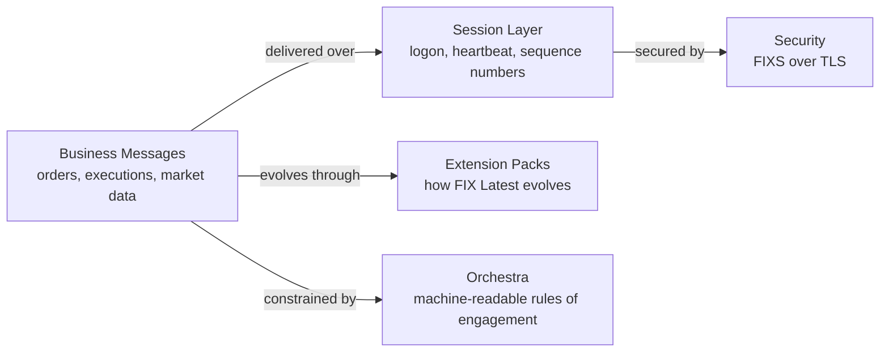
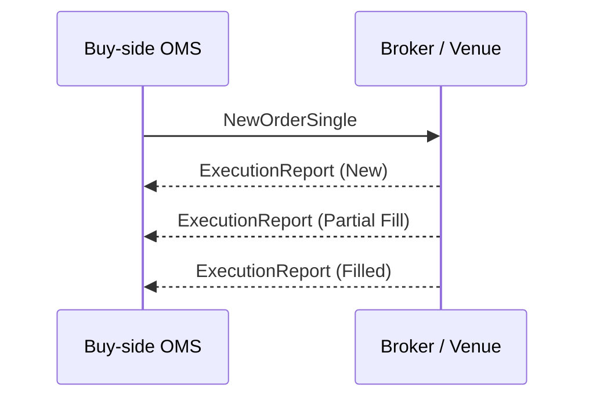
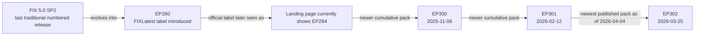
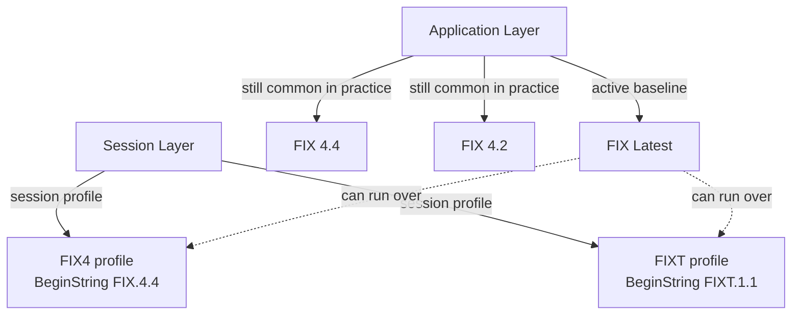

# FIX for Beginners in 2026

Last verified: 2026-04-04

## Quick Take

FIX is the common language that brokers, banks, exchanges, and buy-side firms use to exchange trading messages electronically.

If you are new to finance, keep these points in mind:

- FIX is more than old `tag=value` text. It is a family of standards covering business messages, session control, security, and machine-readable interface rules.
- The current application-layer baseline is **FIX Latest**. It evolves through cumulative **Extension Packs (EPs)** rather than a new numbered version every few years.
- As of 2026-04-04, the official online-specification landing page still shows **EP284**, but the official Extension Packs catalog lists **EP302** published on **2026-03-25**. To understand what is latest, you need both views.

## What FIX Does

In plain English, FIX lets one system say things like:

- "Please place this buy order."
- "I accepted your order."
- "Part of your order traded."
- "Here is the latest market price."
- "Here is the post-trade allocation or confirmation."

The official application-layer specification groups FIX into these business areas:

- Introduction
- Pre-Trade
- Trade
- Post-Trade
- Infrastructure

Source:

- [FIX Latest Online Specification](https://www.fixtrading.org/online-specification)

## The Simplest Mental Model



In this guide, edge labels explain the relationship, not packet direction.

### Business messages

These are the messages that carry trading meaning: orders, fills, cancels, market data, allocations, and confirmations.

### Session layer

This is the reliability layer. It keeps both sides synchronized using logon, logout, heartbeats, sequence numbers, resend requests, and gap recovery.

The session-layer standard also says that if TCP/IP is used as transport, implementations should use **FIX-over-TLS (FIXS)** for encryption.

### Extension Packs

Extension Packs are how new FIX functionality gets published. Each new EP is cumulative, so FIX Latest always means "everything approved up to the latest published EP."

### Orchestra

In practice, firms need more than the standard itself. They also need exact agreement on which messages, fields, workflows, and operational behaviors they support. **FIX Orchestra** is the standard designed to make those rules machine-readable.

Source:

- [FIX Session Layer Online](https://www.fixtrading.org/standards/fix-session-layer-online/)
- [FIX Extension Packs](https://www.fixtrading.org/extension-packs/)
- [Orchestra Online](https://www.fixtrading.org/standards/fix-orchestra-online/)

## How A Simple Order Flow Works



This is the simplest way to think about FIX in production:

- the client sends an order
- the broker or venue acknowledges it
- later messages report the trading outcome

For beginners, that is enough to understand why FIX matters: it standardizes the lifecycle of a trade.

## Concrete Message Examples

The examples below are intentionally simplified for learning.

- They use `|` instead of the real FIX delimiter for readability.
- They omit fields such as `BodyLength(9)` and `CheckSum(10)`.
- They show the business meaning, not every required production detail.

### Example: Logon

```text
8=FIXT.1.1|35=A|49=BUY1|56=BROKER1|98=0|108=30|1137=10
```

What this means:

- `35=A` means Logon
- `49` and `56` identify sender and target
- `108=30` means a 30-second heartbeat interval
- `1137=10` indicates the default application version, which can be used for FIX Latest in a modern session setup

### Example: New Order

```text
35=D|49=BUY1|56=BROKER1|11=ORD123|55=7203.T|54=1|38=100|40=2|44=2500|59=0
```

What this means:

- `35=D` means `NewOrderSingle`
- `11=ORD123` is the client order ID
- `55=7203.T` is the instrument
- `54=1` means buy
- `38=100` is the quantity
- `40=2` means limit order
- `44=2500` is the limit price
- `59=0` means day order

In plain language: "Buy 100 shares of this instrument at a limit price of 2500 for today."

### Example: Execution Report

```text
35=8|49=BROKER1|56=BUY1|11=ORD123|37=BRK9001|17=EXEC1|150=F|39=2|14=100|151=0
```

What this means:

- `35=8` means `ExecutionReport`
- `11=ORD123` ties the report back to the client order
- `37=BRK9001` is the broker order ID
- `17=EXEC1` is the execution ID
- `150=F` means trade/fill execution type
- `39=2` means the order is filled
- `14=100` means cumulative filled quantity is 100
- `151=0` means nothing is left open

In plain language: "Your order is now fully filled."

## What "Latest" Means In Practice



The key idea is simple:

- FIX 5.0 SP2 was the last traditional numbered application-layer release.
- After that, the standard kept growing through Extension Packs.
- FIX Latest is the cumulative result of those Extension Packs.

One nuance matters for documentation users:

- the official landing page still says **EP284**
- the Extension Packs catalog shows newer releases through **EP302**
- some downloadable artifacts lag behind that newest catalog entry

As of 2026-04-04:

- [FIX Latest Online Specification](https://www.fixtrading.org/online-specification) shows EP284
- [FIX Extension Packs](https://www.fixtrading.org/extension-packs/) lists EP302
- [Latest FIXimate](https://www.fixtrading.org/packages/latest-fiximate/) still shows EP301
- [Latest FIXML Schema](https://www.fixtrading.org/packages/latest-ep-fixml-schema/) still shows EP301

For a beginner, the safe reading is:

- use the online specification to understand structure and concepts
- use the Extension Packs catalog to check the newest published changes

## Supported Versions And A Common Confusion



Many beginners think `BeginString(8)` tells them the full FIX version. That is no longer enough.

The official guidance says:

- `BeginString(8)` identifies the **session profile**
- the application version is communicated separately, for example through `DefaultApplVerID(1137)`

This is why a real FIX interface is usually best understood as:

- business messages at a specific application version
- carried over a specific session profile
- with counterparty-specific rules of engagement layered on top

Practical takeaway:

- **FIX Latest** is the active baseline for new functionality
- **FIX 4.2** and **FIX 4.4** still matter because many counterparties still use them
- modern systems often need to understand both worlds at the same time

Source:

- [Supported Versions of the FIX Protocol](https://www.fixtrading.org/supported-versions-of-the-fix-protocol/)
- [FIX Session Layer Online](https://www.fixtrading.org/standards/fix-session-layer-online/)

## Where FIX Is Moving

The recent Extension Packs show that FIX is still changing for real business needs, not just being maintained for legacy compatibility.

Recent examples:

- **EP300** added support for the EU consolidated tape for bonds and equities
- **EP301** added securities lending trade enhancements and UK bond consolidated-tape-related improvements
- **EP302** improved FX NDF fixing support when an NDF appears inside a multi-leg strategy or swap

The broader 2026 signals are also clear:

- FIX launched a working group on **24-hour US equity trading**
- FIX published recommendations on **AI risk management in trading**
- FIX has publicly discussed more **machine-usable execution metadata** for AI-driven tools and analytics

These are signs that FIX is evolving along three fronts:

- regulation
- market structure
- machine readability and automation

Sources:

- [FIX launches 24-hour trading working group](https://www.fixtrading.org/fix-launches-24-hour-trading-working-group/)
- [FIX recommends regulatory approaches to AI in trading](https://www.fixtrading.org/fix-recommends-regulatory-approaches-to-ai-in-trading-mas-consultation/)
- [FIX targets machine-usable execution tags for AI agents](https://www.fixtrading.org/fix-targets-machine-usable-execution-tags-for-ai-agents/)

## What To Learn First

If you are new to both finance and FIX, this learning order works well:

- understand the order lifecycle
- understand logon, heartbeat, sequence numbers, resend, and gap fill
- understand the difference between session profile and application version
- understand how Extension Packs change FIX Latest
- understand that every counterparty still adds its own operating rules

For this repository in particular, the most important FIX topics are:

- order entry
- execution reports
- market data basics
- session reliability and recovery
- compatibility between modern FIX Latest thinking and legacy counterparty connections

## Sources

- https://www.fixtrading.org/online-specification
- https://www.fixtrading.org/supported-versions-of-the-fix-protocol/
- https://www.fixtrading.org/transition-from-fix-5-0-sp2-to-fix-latest-completed/
- https://www.fixtrading.org/extension-packs/
- https://www.fixtrading.org/ep301-added-to-fix-latest-securities-lending-trade-enhancements/
- https://www.fixtrading.org/packages/latest-fiximate/
- https://www.fixtrading.org/packages/latest-ep-fixml-schema/
- https://www.fixtrading.org/standards/fix-session-layer-online/
- https://www.fixtrading.org/standards/fix-orchestra-online/
- https://www.fixtrading.org/fix-launches-24-hour-trading-working-group/
- https://www.fixtrading.org/fix-recommends-regulatory-approaches-to-ai-in-trading-mas-consultation/
- https://www.fixtrading.org/fix-targets-machine-usable-execution-tags-for-ai-agents/
